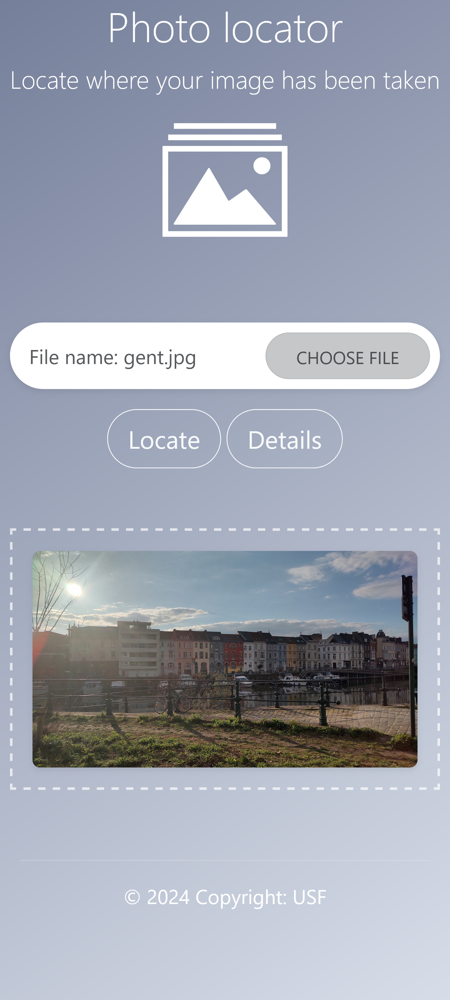
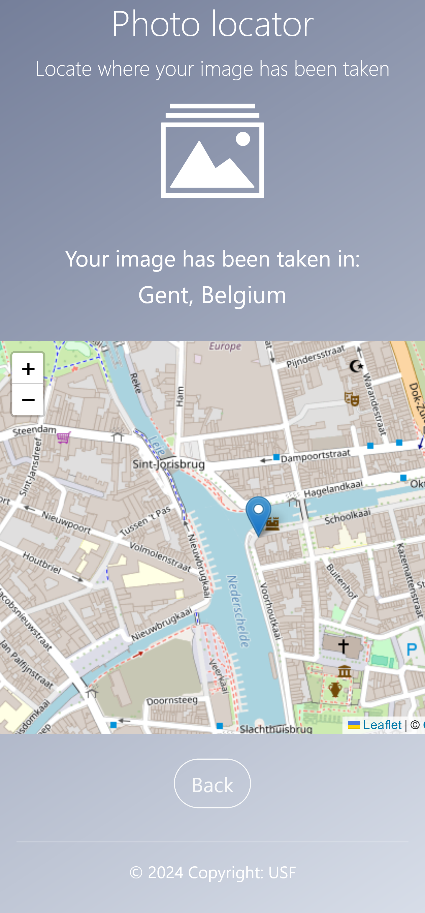
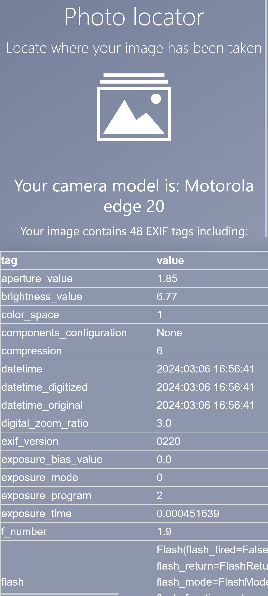

# Photolocator

A simple web application written with Flask where you can upload a photo and get the location (city, country) from the exif tags.

### Screenshots

  
  
  

### Uses

* [exif](https://exif.readthedocs.io/en/latest/usage.html) library
* [Flask](https://flask.palletsprojects.com/en/3.0.x/)
* [LeafletJS](https://leafletjs.com/) :heart: 🇺🇦

### Run with Docker

In the app directory:

    docker build -t photolocator
    docker run -p 8000:8000 photolocator

### Sources

Project inspired by these great articles: 

* https://auth0.com/blog/read-edit-exif-metadata-in-photos-with-python/
* https://dev.to/feranmiodugbemi/image-conversion-web-app-with-python-1e18
* https://medium.com/google-cloud/deploy-a-python-flask-server-using-google-cloud-run-d47f728cc864
* https://medium.com/@dassandrew3/how-to-send-html-form-data-to-pythons-microframework-flask-29a674716b30

