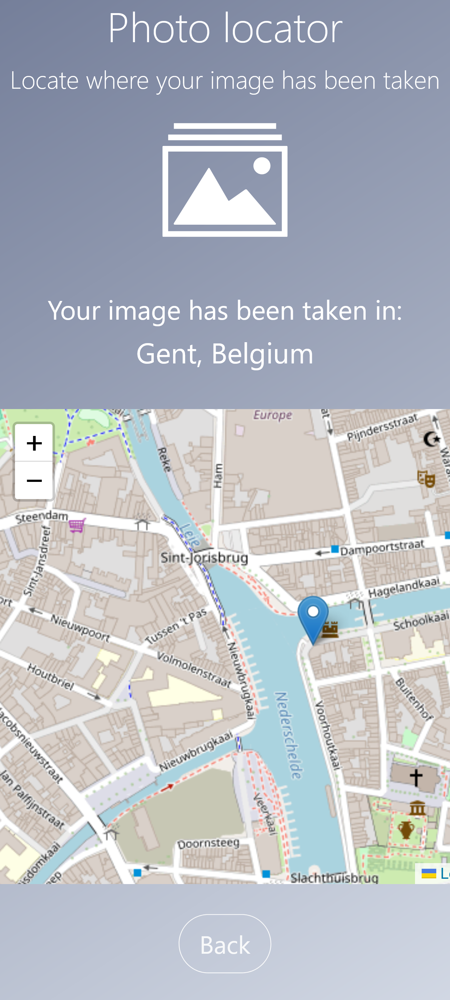

# Photolocator

A Flask page where you can upload a photo and get the location (city, country) from the exif tags

### Screenshots

  
  
  

### Uses

* Python exif library
* Flask
* LeafletJS :heart: 🇺🇦
* 
### Run with Docker

In the app directory:

    docker build -t photolocator
    docker run -p 8000:8000 photolocator

### Sources

Project inspired by these great articles: 

* https://auth0.com/blog/read-edit-exif-metadata-in-photos-with-python/
* https://dev.to/feranmiodugbemi/image-conversion-web-app-with-python-1e18
* https://medium.com/google-cloud/deploy-a-python-flask-server-using-google-cloud-run-d47f728cc864

### TODO
- [x] ~~Improved styling~~
- [x] ~~Use Jinja templates~~
- [x] ~~Better exception handling if no latitude / longitude~~
- [X] ~~Deploy somewhere~~
- [x] ~~Display exif info in table~~
- [X] ~~view on map~~
- [X] ~~Dockerfile~~
- [ ] GET version api
- [ ] add logging

